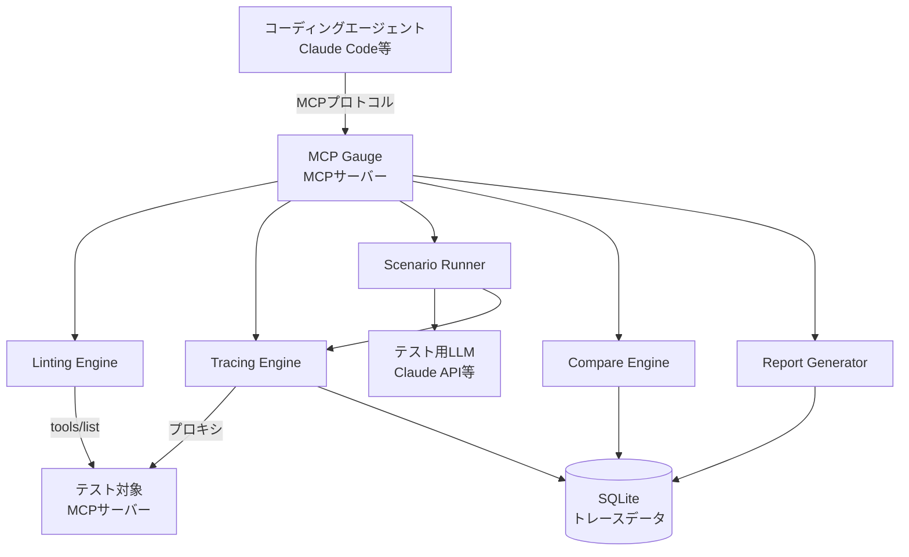
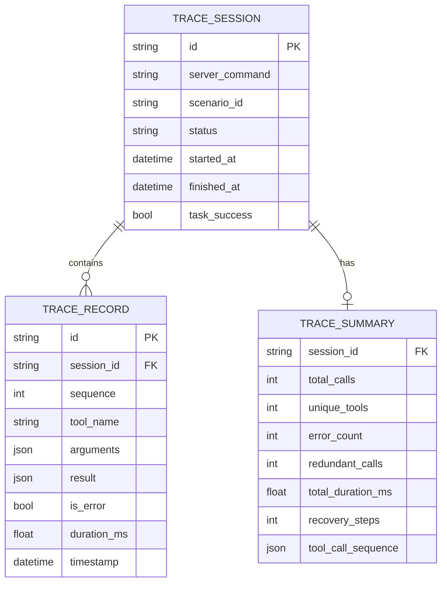
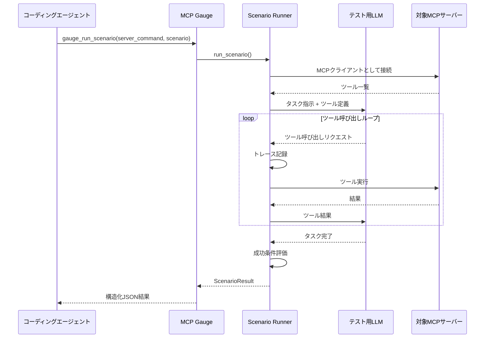
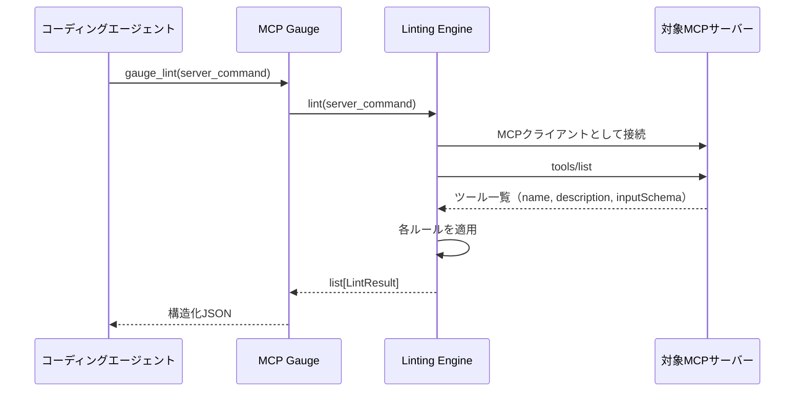
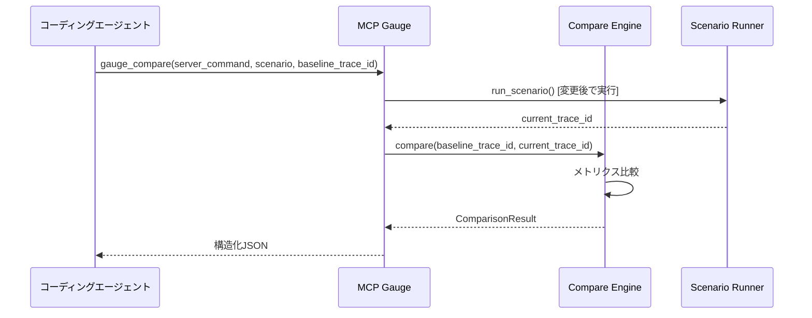

# 機能設計書 (Functional Design Document)

## システム構成図



**アーキテクチャの要点**:
- MCP GaugeはMCPサーバーとして動作し、コーディングエージェントがMCPクライアントとしてツールを呼び出す
- テスト対象MCPサーバーへの接続は、MCP Gaugeが内部的にMCPクライアントとして行う
- E2Eテスト実行時は、テスト用LLM（Claude API等）を使って実際のツール呼び出しパターンを生成する
- トレースデータはSQLiteに蓄積し、比較・レポートに活用する

## 技術スタック

| 分類 | 技術 | 選定理由 |
|------|------|----------|
| 言語 | Python 3.12+ | MCPサーバーSDKの成熟度、エージェント開発エコシステム |
| MCPサーバー | mcp (Python SDK) | 公式SDK、stdio/SSEトランスポート対応 |
| MCPクライアント | mcp (Python SDK) | 対象サーバーへの接続用、同一ライブラリで統一 |
| LLM API | Anthropic Python SDK | テスト用LLMとしてClaude APIを利用 |
| データベース | SQLite (aiosqlite) | ローカルファイルで完結、依存最小、非同期対応 |
| データモデル | Pydantic 2.x | 型安全なデータモデル、JSON変換の自動化、MCPのinputSchemaとの親和性 |
| パッケージ管理 | uv | 高速な依存解決、ロックファイル対応 |
| テスト | pytest + pytest-asyncio | 非同期テスト対応 |
| リンター/フォーマッター | ruff | 高速、設定最小 |
| 型チェック | mypy | 静的型解析で型安全性を担保 |

## データモデル定義

### エンティティ: TraceSession

テスト実行（1シナリオ or 手動トレース）の単位を表す。

```python
class TraceSession:
    id: str                    # UUID v4
    server_command: str        # 対象MCPサーバーの起動コマンド
    server_args: list[str]     # 対象MCPサーバーの起動引数
    scenario_id: str | None    # 紐づくシナリオID（手動トレース時はNone）
    status: SessionStatus      # "running" | "completed" | "failed"
    started_at: datetime       # 開始日時
    finished_at: datetime | None  # 終了日時
    task_success: bool | None  # タスク成功/失敗（シナリオ実行時）
    summary: TraceSummary | None  # 集計サマリー
```

### エンティティ: TraceRecord

個別のツール呼び出し記録。

```python
class TraceRecord:
    id: str                    # UUID v4
    session_id: str            # FK → TraceSession.id
    sequence: int              # 呼び出し順序（1始まり）
    tool_name: str             # 呼び出されたツール名
    arguments: dict            # リクエストパラメータ
    result: dict               # レスポンス内容
    is_error: bool             # エラーレスポンスだったか
    duration_ms: float         # 呼び出し所要時間（ミリ秒）
    timestamp: datetime        # 呼び出し日時
```

### エンティティ: TraceSummary

セッションの集計データ。

```python
class TraceSummary:
    total_calls: int           # 総ツール呼び出し回数
    unique_tools: int          # ユニークなツール数
    error_count: int           # エラー回数
    redundant_calls: int       # 冗長な再呼び出し回数
    total_duration_ms: float   # エンドツーエンド所要時間
    recovery_steps: int        # エラーリカバリに要した追加ステップ数
    tool_call_sequence: list[str]  # ツール呼び出し順序
```

### エンティティ: LintResult

リンティング結果。

```python
class LintResult:
    tool_name: str             # 対象ツール名
    severity: Severity         # "error" | "warning" | "info"
    rule: str                  # ルール名（例: "ambiguous-description"）
    message: str               # 問題の説明
    suggestion: str            # 改善提案
    field: str                 # 問題のフィールド（"description" | "parameters.xxx"）
```

### エンティティ: ScenarioDefinition

テストシナリオの定義。

```python
class ScenarioDefinition:
    id: str                    # シナリオID
    name: str                  # シナリオ名
    description: str           # シナリオの説明
    task_instruction: str      # LLMに与えるタスク指示
    success_criteria: SuccessCriteria  # 成功条件
    setup: list[dict] | None          # 事前準備ステップ（MVP段階ではNone固定。Post-MVPで型定義）
    teardown: list[str] | None        # 事後クリーンアップ
```

### エンティティ: SuccessCriteria

シナリオの成功条件。

```python
class SuccessCriteria:
    max_steps: int | None              # 最大ステップ数
    required_tools: list[str] | None   # 必ず呼ばれるべきツール
    forbidden_tools: list[str] | None  # 呼ばれてはいけないツール
    must_succeed: bool                 # タスク成功が必須か
    custom_assertions: list[str] | None  # カスタムアサーション（JSONPath式）
```

### エンティティ: ScenarioResult

シナリオ実行結果。

```python
class ScenarioResult:
    scenario_id: str               # シナリオID
    trace_id: str                  # トレースセッションID
    passed: bool                   # 合否
    task_success: bool             # タスク成功/失敗
    summary: TraceSummary          # トレースサマリー
    criteria_evaluation: CriteriaEvaluation  # 成功条件の評価結果
```

### エンティティ: CriteriaEvaluation

成功条件の個別評価結果。

```python
class CriteriaEvaluation:
    max_steps: dict | None         # {"passed": bool, "limit": int, "actual": int}
    required_tools: dict | None    # {"passed": bool, "missing": list[str]}
    forbidden_tools: dict | None   # {"passed": bool, "violated": list[str]}
    must_succeed: dict | None      # {"passed": bool}
```

### エンティティ: SuiteResult

テストスイート実行結果。

```python
class SuiteResult:
    suite_path: str                # スイート定義ファイルパス
    total: int                     # 総シナリオ数
    passed: int                    # 合格数
    failed: int                    # 不合格数
    results: list[ScenarioResult]  # 各シナリオの結果
```

### エンティティ: ComparisonResult

ベースライン比較結果。

```python
class ComparisonResult:
    baseline_trace_id: str         # ベースラインのトレースID
    current_trace_id: str          # 現在のトレースID
    overall_verdict: str           # "improved" | "degraded" | "unchanged"
    metrics: dict[str, MetricComparison]  # メトリクスごとの比較
```

### エンティティ: MetricComparison

個別メトリクスの比較結果。

```python
class MetricComparison:
    baseline: float | bool         # ベースライン値
    current: float | bool          # 現在値
    change: float | None           # 変化量（数値の場合）
    verdict: str                   # "improved" | "degraded" | "unchanged"
```

### エンティティ: Report

統合レポート。

```python
class Report:
    trace_ids: list[str]           # 対象トレースIDリスト
    generated_at: datetime         # 生成日時
    sessions: list[TraceSummary]   # 各セッションのサマリー
    aggregated_calls: float        # 平均ツール呼び出し回数
    aggregated_errors: float       # 平均エラー回数
    aggregated_redundant: float    # 平均冗長呼び出し回数
    recommendations: list[str]    # 改善推奨事項
```

### エンティティ: GaugeConfig

MCP Gaugeの設定。

```python
class GaugeConfig:
    db_path: str                   # SQLiteファイルパス（デフォルト: ~/.mcp-gauge/gauge.db）
    anthropic_api_key: str         # 環境変数 ANTHROPIC_API_KEY から取得
    anthropic_model: str           # テスト用LLMモデル（デフォルト: claude-sonnet-4-20250514）
    mcp_timeout_sec: int           # 対象サーバー接続タイムアウト（デフォルト: 30）
```

### ER図



## コンポーネント設計

### MCPサーバーレイヤー（GaugeServer）

**責務**:
- MCPプロトコルでツールを公開する
- コーディングエージェントからのリクエストを受け付け、適切なエンジンに委譲する
- 結果を構造化JSONで返す

```python
class GaugeServer:
    def __init__(self, config: GaugeConfig):
        self.mcp = Server("mcp-gauge")
        self.lint_engine = LintEngine()
        self.trace_engine = TraceEngine(config.db_path)
        self.scenario_runner = ScenarioRunner(config)
        self.compare_engine = CompareEngine(config.db_path)
        self.report_generator = ReportGenerator(config.db_path)

    async def run(self) -> None:
        """MCPサーバーとして起動する"""

    # 公開ツール
    async def gauge_lint(self, server_command: str, server_args: list[str] | None) -> list[LintResult]: ...
    async def gauge_trace_start(self, server_command: str, server_args: list[str] | None) -> str: ...
    async def gauge_trace_stop(self, trace_id: str) -> TraceSummary: ...
    async def gauge_run_scenario(self, server_command: str, scenario: dict, server_args: list[str] | None) -> ScenarioResult: ...
    async def gauge_run_suite(self, server_command: str, suite_path: str, server_args: list[str] | None) -> SuiteResult: ...
    async def gauge_compare(self, server_command: str, scenario: dict, baseline_trace_id: str, server_args: list[str] | None) -> ComparisonResult: ...
    async def gauge_report(self, trace_ids: list[str]) -> Report: ...
```

### Linting Engine

**責務**:
- 対象MCPサーバーに接続し、ツール一覧を取得する
- 各ツールのdescriptionとinputSchemaに対してルールベースの静的解析を行う
- LLM呼び出し不要で高速に実行する

```python
class LintEngine:
    def __init__(self):
        self.rules: list[LintRule] = [
            AmbiguousDescriptionRule(),
            MissingParameterDescriptionRule(),
            MissingDefaultValueRule(),
            MissingReturnDescriptionRule(),
            DescriptionLengthRule(),
        ]

    async def lint(self, server_command: str, server_args: list[str] | None) -> list[LintResult]:
        """対象サーバーのツールをリンティングする"""

    async def _connect_and_list_tools(self, server_command: str, server_args: list[str] | None) -> list[Tool]:
        """対象サーバーに接続し、ツール一覧を取得する"""
```

**リンティングルール**:

| ルール名 | 重大度 | 検出内容 |
|---------|--------|---------|
| `ambiguous-description` | warning | 曖昧な表現（「適切な」「必要に応じて」「etc.」等） |
| `missing-param-description` | error | 必須パラメータにdescriptionがない |
| `missing-default-value` | warning | 任意パラメータのデフォルト値が未記載 |
| `missing-return-description` | warning | 戻り値の構造が未記載 |
| `description-too-short` | info | descriptionが20文字未満 |
| `description-too-long` | info | descriptionが500文字超 |

### Tracing Engine

**責務**:
- 対象MCPサーバーへのツール呼び出しをプロキシし記録する
- メトリクスを計算する（冗長呼び出し検出、リカバリステップ計測等）
- トレースデータをSQLiteに保存する

```python
class TraceEngine:
    def __init__(self, db_path: str):
        self.storage = TraceStorage(db_path)
        self.active_sessions: dict[str, TraceSession] = {}

    async def start_session(self, server_command: str, server_args: list[str] | None) -> str:
        """トレースセッションを開始し、trace_idを返す"""

    async def record_call(self, session_id: str, tool_name: str, arguments: dict, result: dict, is_error: bool, duration_ms: float) -> None:
        """ツール呼び出しを記録する"""

    async def stop_session(self, session_id: str) -> TraceSummary:
        """セッションを終了し、サマリーを計算して返す"""

    def _calculate_summary(self, records: list[TraceRecord]) -> TraceSummary:
        """トレースレコードからサマリーを計算する"""

    def _detect_redundant_calls(self, records: list[TraceRecord]) -> int:
        """冗長な再呼び出しを検出する"""

    def _count_recovery_steps(self, records: list[TraceRecord]) -> int:
        """エラーリカバリに要した追加ステップを計算する"""
```

**冗長呼び出しの検出ロジック**:
- 連続する同一ツール呼び出しで、引数が同一またはほぼ同一のものを冗長と判定
- エラー後の同一ツール再呼び出し（リトライ）は冗長に含めない

**引数の類似度判定**:
```python
def _args_similar(a: dict, b: dict) -> bool:
    """引数の類似度を判定する。
    - キーセットが同一
    - 各キーの値が完全一致、または以下の等価ペア:
      None と ""（空文字列）、None と []（空リスト）、None と {}（空辞書）
    """
    if set(a.keys()) != set(b.keys()):
        return False
    for key in a:
        if a[key] == b[key]:
            continue
        # None と空値の等価判定
        if {a[key], b[key]} <= {None, "", [], {}}:
            continue
        return False
    return True
```

**リカバリステップの計測ロジック**:
- エラーレスポンス発生後、次にエラーなしでタスクが進行するまでのステップ数を加算

### Scenario Runner

**責務**:
- テストシナリオを読み込み、テスト用LLMにタスク指示を与えて実行する
- LLMのツール呼び出しを対象MCPサーバーに転送し、結果をトレースする
- 成功条件に基づいて合否を判定する

```python
class ScenarioRunner:
    def __init__(self, config: GaugeConfig):
        self.llm_client = AnthropicClient(config.anthropic_api_key)
        self.trace_engine = TraceEngine(config.db_path)

    async def run_scenario(self, server_command: str, scenario: ScenarioDefinition, server_args: list[str] | None) -> ScenarioResult:
        """シナリオを実行し、結果を返す"""

    async def run_suite(self, server_command: str, suite_path: str, server_args: list[str] | None) -> SuiteResult:
        """スイート（複数シナリオ）を一括実行する"""

    async def _execute_with_llm(self, scenario: ScenarioDefinition, target_tools: list[Tool]) -> tuple[list[TraceRecord], bool]:
        """LLMにタスクを実行させ、ツール呼び出しをトレースする"""

    def _evaluate_criteria(self, summary: TraceSummary, criteria: SuccessCriteria, task_success: bool) -> CriteriaEvaluation:
        """成功条件を評価する"""
```

**LLMテスト実行フロー**:



### Compare Engine

**責務**:
- ベースライン（変更前）のトレースと、新規実行（変更後）のトレースを比較する
- 各メトリクスの改善/悪化を判定する

```python
class CompareEngine:
    def __init__(self, db_path: str):
        self.storage = TraceStorage(db_path)

    async def compare(self, baseline_trace_id: str, current_trace_id: str) -> ComparisonResult:
        """2つのトレースセッションを比較する"""

    def _compare_metric(self, baseline: float, current: float, lower_is_better: bool) -> MetricComparison:
        """個別メトリクスの改善/悪化を判定する"""
```

**比較メトリクス**:

| メトリクス | 改善方向 | 説明 |
|-----------|---------|------|
| total_calls | 少ないほど良い | 総ツール呼び出し回数 |
| error_count | 少ないほど良い | エラー回数 |
| redundant_calls | 少ないほど良い | 冗長な再呼び出し回数 |
| total_duration_ms | 少ないほど良い | 所要時間 |
| recovery_steps | 少ないほど良い | リカバリステップ数 |
| task_success | true が良い | タスク成功/失敗 |

### Report Generator

**責務**:
- 複数のトレースセッションを統合してレポートを生成する
- エージェントが次のアクションを判断できる構造化データを返す

```python
class ReportGenerator:
    def __init__(self, db_path: str):
        self.storage = TraceStorage(db_path)

    async def generate(self, trace_ids: list[str]) -> Report:
        """統合レポートを生成する"""
```

### データレイヤー（TraceStorage）

**責務**:
- SQLiteへのトレースデータの永続化と取得

```python
class TraceStorage:
    def __init__(self, db_path: str):
        self.db_path = db_path

    async def init_db(self) -> None:
        """テーブルを初期化する"""

    async def save_session(self, session: TraceSession) -> None: ...
    async def save_record(self, record: TraceRecord) -> None: ...
    async def save_summary(self, session_id: str, summary: TraceSummary) -> None: ...
    async def get_session(self, session_id: str) -> TraceSession: ...
    async def get_records(self, session_id: str) -> list[TraceRecord]: ...
    async def get_summary(self, session_id: str) -> TraceSummary: ...
```

## ユースケース詳細

### ユースケース1: ツール説明文リンティング



**エージェントが受け取るレスポンス例**:
```json
{
  "total_tools": 5,
  "total_issues": 3,
  "issues": [
    {
      "tool_name": "create_resource",
      "severity": "error",
      "rule": "missing-param-description",
      "message": "必須パラメータ 'config' にdescriptionがありません",
      "suggestion": "パラメータの用途、期待される形式、有効な値の範囲を記述してください",
      "field": "parameters.config"
    },
    {
      "tool_name": "list_resources",
      "severity": "warning",
      "rule": "ambiguous-description",
      "message": "descriptionに曖昧な表現 '適切な値' が含まれています",
      "suggestion": "'適切な値' を具体的な値や形式に置き換えてください（例: 'リソース名を英数字とハイフンで指定'）",
      "field": "description"
    }
  ]
}
```

### ユースケース2: シナリオベースE2Eテスト

**シナリオ定義例（YAML）**:
```yaml
id: create-and-list-resource
name: リソースの作成と一覧取得
description: リソースを1つ作成し、一覧で確認するシナリオ
task_instruction: |
  MCPサーバーを使って以下を行ってください:
  1. "test-resource" という名前のリソースを作成する
  2. リソース一覧を取得し、作成したリソースが含まれていることを確認する
success_criteria:
  max_steps: 5
  required_tools:
    - create_resource
    - list_resources
  forbidden_tools:
    - delete_resource
  must_succeed: true
```

**エージェントが受け取るレスポンス例**:
```json
{
  "scenario_id": "create-and-list-resource",
  "trace_id": "550e8400-e29b-41d4-a716-446655440000",
  "passed": true,
  "task_success": true,
  "summary": {
    "total_calls": 3,
    "unique_tools": 2,
    "error_count": 0,
    "redundant_calls": 0,
    "total_duration_ms": 1520.5,
    "recovery_steps": 0,
    "tool_call_sequence": ["create_resource", "list_resources", "list_resources"]
  },
  "criteria_evaluation": {
    "max_steps": {"passed": true, "limit": 5, "actual": 3},
    "required_tools": {"passed": true, "missing": []},
    "forbidden_tools": {"passed": true, "violated": []},
    "must_succeed": {"passed": true}
  }
}
```

### ユースケース3: Prompts比較



**エージェントが受け取るレスポンス例**:
```json
{
  "baseline_trace_id": "550e8400-...",
  "current_trace_id": "661f9511-...",
  "overall_verdict": "improved",
  "metrics": {
    "total_calls": {"baseline": 7, "current": 4, "change": -3, "verdict": "improved"},
    "error_count": {"baseline": 2, "current": 0, "change": -2, "verdict": "improved"},
    "redundant_calls": {"baseline": 2, "current": 1, "change": -1, "verdict": "improved"},
    "total_duration_ms": {"baseline": 3200, "current": 1800, "change": -1400, "verdict": "improved"},
    "recovery_steps": {"baseline": 3, "current": 0, "change": -3, "verdict": "improved"},
    "task_success": {"baseline": true, "current": true, "verdict": "unchanged"}
  }
}
```

## アルゴリズム設計

### 冗長呼び出し検出アルゴリズム

**目的**: 同一ツールへの不必要な再呼び出しを検出する

**判定ロジック**:

#### ステップ1: 連続する同一ツール呼び出しの検出
- 直前のレコードと同じtool_nameの呼び出しを候補とする

#### ステップ2: リトライの除外
- 直前のレコードがis_error=trueの場合、リトライとみなし冗長から除外する

#### ステップ3: 引数の類似度判定
- 引数が完全一致、またはキーが同一で値の差分が軽微（空文字列 vs None等）の場合、冗長と判定する

```python
def detect_redundant_calls(records: list[TraceRecord]) -> int:
    redundant = 0
    for i in range(1, len(records)):
        prev = records[i - 1]
        curr = records[i]
        if curr.tool_name != prev.tool_name:
            continue
        if prev.is_error:
            continue  # リトライは冗長ではない
        if _args_similar(prev.arguments, curr.arguments):
            redundant += 1
    return redundant
```

### リカバリステップ計測アルゴリズム

**目的**: エラー発生後、正常フローに復帰するまでの追加ステップ数を計測する

**判定ロジック**:

#### ステップ1: エラー発生の検出
- is_error=trueのレコードを起点とする

#### ステップ2: リカバリ完了の判定
- エラー後、is_error=falseかつ異なるツールが呼ばれた時点でリカバリ完了とみなす

#### ステップ3: ステップ数の集計
- エラー発生からリカバリ完了までのレコード数を加算する

```python
def count_recovery_steps(records: list[TraceRecord]) -> int:
    recovery_steps = 0
    in_recovery = False
    error_tool = None
    for record in records:
        if record.is_error:
            in_recovery = True
            error_tool = record.tool_name
            continue
        if in_recovery:
            recovery_steps += 1
            # 異なるツールが成功した時点でリカバリ完了
            if record.tool_name != error_tool:
                in_recovery = False
                error_tool = None
    return recovery_steps
```

### リンティングルール: 曖昧表現検出

**目的**: ツールdescriptionに含まれるLLMが判断困難な曖昧表現を検出する

**検出パターン**:
```python
AMBIGUOUS_PATTERNS = [
    (r"適切な", "具体的な値や形式を明記してください"),
    (r"必要に応じて", "どのような条件で必要になるかを明記してください"),
    (r"etc\.?|など$|等$", "省略せず具体的な選択肢を列挙してください"),
    (r"正しい|正しく", "何が「正しい」のか基準を明記してください"),
    (r"適当な", "具体的な値や形式を明記してください"),
    (r"any suitable", "具体的な条件を明記してください"),
    (r"as needed", "どのような場合に必要かを明記してください"),
    (r"if necessary", "どのような条件で必要かを明記してください"),
]
```

## ファイル構造

### トレースデータ保存

```
~/.mcp-gauge/
├── gauge.db           # SQLiteデータベース（トレースデータ）
└── config.toml        # 設定ファイル（オプション）
```

### テストシナリオ保存（ユーザープロジェクト側）

```
<project>/
├── gauge/
│   ├── scenarios/
│   │   ├── scenario-1.yaml
│   │   └── scenario-2.yaml
│   └── suite.yaml          # スイート定義（シナリオ一覧）
```

**suite.yaml例**:
```yaml
name: 基本機能テストスイート
scenarios:
  - scenarios/scenario-1.yaml
  - scenarios/scenario-2.yaml
```

## エラーハンドリング

### エラーの分類

| エラー種別 | 処理 | エージェントへの返却 |
|-----------|------|-------------------|
| 対象サーバー接続失敗 | 処理を中断 | `{"error": "connection_failed", "message": "...", "suggestion": "server_commandとserver_argsを確認してください"}` |
| 対象サーバータイムアウト | 処理を中断 | `{"error": "timeout", "message": "...", "suggestion": "対象サーバーの起動時間を確認してください"}` |
| LLM API エラー | 処理を中断 | `{"error": "llm_api_error", "message": "...", "suggestion": "ANTHROPIC_API_KEYの設定を確認してください"}` |
| シナリオ定義不正 | 処理を中断 | `{"error": "invalid_scenario", "message": "...", "suggestion": "シナリオのYAML形式を確認してください"}` |
| トレースID不存在 | 処理を中断 | `{"error": "trace_not_found", "message": "...", "suggestion": "有効なtrace_idを指定してください"}` |
| テスト実行中のツールエラー | トレースに記録して続行 | 正常結果の一部としてerror_countに反映 |

全エラーレスポンスに`suggestion`フィールドを含め、エージェントが自律的に問題を解決できるようにする。

## セキュリティ考慮事項

- **APIキー管理**: ANTHROPIC_API_KEYは環境変数から取得。ツールパラメータでは受け付けない
- **対象サーバーの隔離**: テスト対象MCPサーバーはサブプロセスとして起動し、MCP Gaugeのプロセスとは分離する
- **トレースデータの機密性**: トレースデータには対象サーバーの入出力が含まれるため、ローカルファイルシステムに保存しアクセス制御はOSに委譲する
- **破壊的操作の防止**: MCP Gaugeはテスト対象サーバーのツールを直接呼び出すが、シナリオ定義のforbidden_toolsで破壊的ツールの実行を制御可能にする

## パフォーマンス最適化

- **リンティング**: ルール評価は正規表現ベースで、LLM呼び出しを行わないため高速（100ツールで5秒以内）
- **トレース記録**: 非同期でSQLiteに書き込み、ツール呼び出しのクリティカルパスへの影響を最小化
- **書き込み戦略**: TraceRecordは呼び出し都度コミット（クラッシュ時の部分データ保持を優先）。TraceSummaryはセッション終了時にコミット（集計の整合性を保証）。SQLite WALモードにより逐次コミットでも十分な書き込み性能を確保

## テスト戦略

### ユニットテスト
- LintEngineの各ルール: 既知の良い/悪いdescriptionに対する検出精度
- 冗長呼び出し検出アルゴリズム: 各パターン（リトライ除外含む）の正確性
- リカバリステップ計測: エラー発生パターンごとの正確性
- 成功条件評価ロジック: 各条件（max_steps, required_tools等）の判定

### 統合テスト
- MCP Gauge → テスト対象MCPサーバー間の接続・ツール一覧取得
- トレースデータのSQLite保存・取得の一貫性
- シナリオ定義のYAML読み込みとバリデーション

### E2Eテスト
- MCP GaugeをClaude Codeから実際に利用し、サンプルMCPサーバーをテストする（dogfooding）
- リンティング → 修正 → 再リンティングの自律ループが完結することの検証
