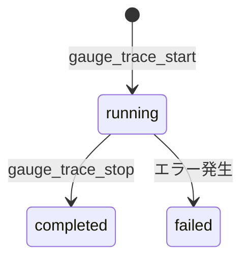

# プロジェクト用語集 (Glossary)

## 概要

このドキュメントは、MCP Gaugeプロジェクトで使用される用語の定義を管理します。

**更新日**: 2026-02-24

## ドメイン用語

### MCP Gauge

**定義**: コーディングエージェントによるMCPサーバー自律開発を実現する計測・評価MCPサーバー

**説明**: MCP Gauge自体がMCPサーバーとして動作し、コーディングエージェント（Claude Code等）がMCPクライアントとしてツールを呼び出す。テスト対象MCPサーバーに対してリンティング・E2Eテスト・Prompts比較等を実行し、エージェントが解釈可能な構造化JSONで結果を返す。

**関連用語**: [自律開発ループ](#自律開発ループ), [テスト対象MCPサーバー](#テスト対象mcpサーバー)

**英語表記**: MCP Gauge

### 自律開発ループ

**定義**: コーディングエージェントが「実装→テスト→チューニング→検証」を人間の介入なしに自律的に繰り返すサイクル

**説明**: MCP Gaugeの中核となるコンセプト。エージェントがMCPサーバーを実装し、MCP Gaugeでテストを実行し、結果を解釈してツール説明文やパラメータ設計を改善する。人間はゴールの設定とレビューに集中する。

**使用例**:
- 「自律開発ループが完結する」: エージェントが人間の介入なしにテスト合格まで到達する
- 「自律開発ループの完結率」: KPIとして計測する指標

**関連用語**: [MCP Gauge](#mcp-gauge), [シナリオ](#シナリオ)

**英語表記**: Autonomous Development Loop

### テスト対象MCPサーバー

**定義**: MCP Gaugeがテスト・評価する対象となるMCPサーバー

**説明**: MCP Gaugeはテスト対象サーバーにMCPクライアントとして接続し、ツール一覧の取得やツールの実行を行う。対象サーバーはサブプロセスとして起動され、`server_command`と`server_args`で指定する。

**使用例**:
- `gauge_lint(server_command="python", server_args=["-m", "my_server"])`

**関連用語**: [MCP Gauge](#mcp-gauge), [トレースセッション](#トレースセッション)

**英語表記**: Target MCP Server

### 呼び出し元エージェント

**定義**: MCP GaugeをMCPツールとして利用するコーディングエージェント（Claude Code等）

**説明**: プロキシ型アーキテクチャにおいて、呼び出し元エージェント自身がLLMとしてツール呼び出し判断を行う。MCP Gaugeはプロキシとしてツール呼び出しを中継・記録するのみで、LLM APIへの直接依存がない。これにより、Claude Codeのサブスクリプションプランを含む任意のMCPクライアントから利用可能。

**関連用語**: [プロキシセッション](#プロキシセッション), [トレース](#トレース)

**英語表記**: Calling Agent

### リンティング

**定義**: MCPサーバーのツールdescriptionとinputSchemaに対する静的品質チェック

**説明**: LLM呼び出し不要で高速に実行できる。曖昧な表現の検出、パラメータ説明の充足度チェック、戻り値の記載チェック等を行う。結果には改善提案（suggestion）が含まれ、エージェントが自律的に修正できる。

**関連用語**: [リンティングルール](#リンティングルール)

**使用例**:
- 「リンティングでwarningが3件検出された」
- 「リンティング結果に基づいてdescriptionを修正する」

**英語表記**: Linting

### リンティングルール

**定義**: リンティング時に適用される個別の品質チェックルール

**使用例**:

| ルール名 | 検出内容 |
|---------|---------|
| `ambiguous-description` | 曖昧な表現（「適切な」「必要に応じて」等） |
| `missing-param-description` | 必須パラメータのdescription不足 |
| `missing-default-value` | 任意パラメータのデフォルト値未記載 |
| `missing-return-description` | 戻り値の構造未記載 |
| `description-too-short` | description が20文字未満 |
| `description-too-long` | description が500文字超 |

**関連用語**: [リンティング](#リンティング), [重大度](#重大度)

**英語表記**: Lint Rule

### トレース

**定義**: テスト対象MCPサーバーへのツール呼び出しの記録・計測プロセス

**説明**: SessionManagerがテスト対象サーバーへのリクエスト/レスポンスをプロキシし、TraceEngineがツール名・引数・結果・所要時間・エラー有無を記録する。呼び出し元エージェントのツール呼び出しパターンを可視化するために使用する。

**関連用語**: [トレースセッション](#トレースセッション-tracesession), [トレースレコード](#トレースレコード-tracerecord), [トレースサマリー](#トレースサマリー-tracesummary)

**英語表記**: Trace / Tracing

### シナリオ

**定義**: E2Eテストの実行単位。成功条件を定義したテストケース

**説明**: プロキシ型アーキテクチャでは、呼び出し元エージェントが自律的にツールを呼び出し、その結果を成功条件（gauge_evaluate）で事後評価する。シナリオ定義はYAML/JSON形式で、成功条件のテンプレートとして利用可能。

**使用例**:
```json
{
  "max_steps": 5,
  "required_tools": ["create_resource", "list_resources"],
  "forbidden_tools": ["delete_resource"],
  "must_succeed": true
}
```

**関連用語**: [成功条件](#成功条件), [プロキシセッション](#プロキシセッション)

**英語表記**: Scenario

### 成功条件

**定義**: シナリオの合否を判定するための条件セット

**説明**: 最大ステップ数、必須ツール呼び出し、禁止ツール呼び出し、タスク成功必須等の条件を組み合わせて定義する。

**主要フィールド**:
- `max_steps`: 最大ツール呼び出し回数
- `required_tools`: 必ず呼ばれるべきツールのリスト
- `forbidden_tools`: 呼ばれてはいけないツールのリスト
- `must_succeed`: タスク成功が必須か

**関連用語**: [シナリオ](#シナリオ)

**英語表記**: Success Criteria

### テストスイート

**定義**: 複数のシナリオをまとめた一括実行単位

**説明**: `suite.yaml`で定義し、含まれるシナリオを順次実行して結果を集約する。

**関連用語**: [シナリオ](#シナリオ)

**英語表記**: Test Suite

### Prompts品質評価

**定義**: MCPサーバーのPromptsやツールdescriptionがLLMのツール利用効率にどう影響するかを定量評価する機能

**説明**: MVP P0機能（F4）。同一シナリオをdescription変更前後で実行し、ステップ数・エラー回数・冗長呼び出し等のメトリクスを比較する。`gauge_compare`ツールで実行する。

**関連用語**: [シナリオ](#シナリオ), [トレースサマリー](#トレースサマリー-tracesummary)

**英語表記**: Prompts Quality Evaluation

### 冗長呼び出し

**定義**: 同一ツールへの不必要な再呼び出し

**説明**: 直前と同じツールを同一または類似の引数で呼び出した場合に冗長と判定する。ただし、エラー後のリトライは冗長に含めない。ツール説明文の改善が必要な指標の一つ。

**関連用語**: [トレースサマリー](#トレースサマリー-tracesummary), [リカバリステップ](#リカバリステップ)

**英語表記**: Redundant Call

### リカバリステップ

**定義**: ツール呼び出しエラーが発生した後、正常フローに復帰するまでに要した追加のツール呼び出し数

**説明**: エラー発生後、エラーなしで異なるツールが呼ばれた時点でリカバリ完了とみなす。この値が大きいほど、エラーメッセージの品質が低い（LLMが復帰に苦労している）ことを示す。

**関連用語**: [冗長呼び出し](#冗長呼び出し), [トレースサマリー](#トレースサマリー-tracesummary)

**英語表記**: Recovery Steps

## 技術用語

### MCP (Model Context Protocol)

**定義**: LLMアプリケーションが外部ツール・データソースと標準化された方法で通信するためのオープンプロトコル

**本プロジェクトでの用途**: MCP GaugeはMCPサーバーとして実装され、MCPクライアント（Claude Code等）からツールとして利用される。また、テスト対象MCPサーバーへの接続にはMCPクライアントとして動作する。

**関連ドキュメント**: [アーキテクチャ設計書](./architecture.md)

### mcp (Python SDK)

**定義**: MCPプロトコルのPython公式SDK。サーバー・クライアント両方の実装を提供する

**本プロジェクトでの用途**: MCP Gaugeサーバーの実装（MCPサーバー側）と、テスト対象サーバーへの接続（MCPクライアント側）の両方に使用

**関連ドキュメント**: [アーキテクチャ設計書](./architecture.md#テクノロジースタック)

### プロキシセッション

**定義**: MCP Gaugeが対象MCPサーバーへのプロキシとして機能するセッション

**説明**: gauge_connect → gauge_proxy_call (繰り返し) → gauge_disconnect のライフサイクルで管理される。SessionManagerが接続管理とトレース記録を担当する。呼び出し元エージェントはツール一覧を見て自律的にツールを呼び出す。

**関連用語**: [呼び出し元エージェント](#呼び出し元エージェント), [トレースセッション](#トレースセッション-tracesession)

**英語表記**: Proxy Session

### SQLite

**定義**: サーバーレスの軽量リレーショナルデータベース

**本プロジェクトでの用途**: トレースデータ（TraceSession, TraceRecord, TraceSummary）の永続化。aiosqliteで非同期アクセス

**関連ドキュメント**: [アーキテクチャ設計書](./architecture.md#データ永続化戦略)

### Pydantic

**定義**: Pythonの型ヒントを活用したデータバリデーション・設定管理ライブラリ

**本プロジェクトでの用途**: 全データモデル（TraceSession, LintResult, ScenarioDefinition等）の定義。JSON変換の自動化とバリデーションに使用

**バージョン**: 2.x

### aiosqlite

**定義**: asyncioと統合されたSQLiteの非同期ラッパーライブラリ

**本プロジェクトでの用途**: TraceStorageからSQLiteへの非同期読み書き。MCPサーバーの非同期処理とSQLite操作を同一イベントループで実行可能にする

### PyYAML

**定義**: PythonでYAMLを読み書きするためのライブラリ

**本プロジェクトでの用途**: シナリオ定義ファイル（scenario.yaml, suite.yaml）の読み込みに使用

### mypy

**定義**: Pythonの静的型チェックツール

**本プロジェクトでの用途**: CI/CD上での型安全性の検証。エンジンレイヤーの型不整合を事前検出する

## 略語・頭字語

### E2E

**正式名称**: End-to-End

**意味**: システム全体を通した一連のフローのテスト

**本プロジェクトでの使用**: MCP Gaugeの中核機能。テスト用LLMが実際にツールを呼び出し、テスト対象MCPサーバーの動作を検証する

### PRD

**正式名称**: Product Requirements Document

**意味**: プロダクト要求定義書

**本プロジェクトでの使用**: `docs/product-requirements.md`

### KPI

**正式名称**: Key Performance Indicator

**意味**: 主要業績評価指標

**本プロジェクトでの使用**: 自律開発ループの完結率、導入プロジェクト数等

### MVP

**正式名称**: Minimum Viable Product

**意味**: 最小限の実行可能なプロダクト

**本プロジェクトでの使用**: P0機能（リンティング、トレーシング、シナリオベースE2Eテスト、Prompts品質評価）の4機能で構成

## アーキテクチャ用語

### レイヤードアーキテクチャ

**定義**: システムを役割ごとに複数の層に分割し、上位層から下位層への一方向の依存関係を持たせる設計パターン

**本プロジェクトでの適用**:

```
MCPサーバーレイヤー (server.py)
    ↓
エンジンレイヤー (engines/)
    ↓
インフラレイヤー (infra/)
```

**関連コンポーネント**: GaugeServer, LintEngine, TraceEngine, SessionManager, EvaluateEngine, TraceStorage

**関連ドキュメント**: [アーキテクチャ設計書](./architecture.md#アーキテクチャパターン)

### MCPプロキシパターン

**定義**: MCP Gaugeが呼び出し元エージェントとテスト対象MCPサーバーの間に立ち、ツール呼び出しを中継・記録するアーキテクチャパターン

**本プロジェクトでの適用**: SessionManagerがエージェントからのツール呼び出しリクエストを受け取り、TraceEngineで記録した後、テスト対象サーバーに転送する。レスポンスも同様に記録してからエージェントに返す。LLM APIへの依存がないため、任意のMCPクライアントから利用可能。

**関連コンポーネント**: SessionManager, TraceEngine, EvaluateEngine

## ステータス・状態

### トレースセッションステータス

**定義**: トレースセッションの実行状態

| ステータス | 意味 | 遷移条件 | 次の状態 |
|----------|------|---------|---------|
| `running` | 実行中 | セッション開始時の初期状態 | `completed`, `failed` |
| `completed` | 正常完了 | セッションが正常に終了 | - |
| `failed` | 異常終了 | エラーにより中断 | - |



### 重大度

**定義**: リンティング結果の重要度レベル

| レベル | 意味 | 対応 |
|-------|------|------|
| `error` | 重大な問題。LLMが正しくツールを使えない可能性が高い | 修正必須 |
| `warning` | 改善推奨。LLMのツール利用効率が低下する可能性 | 修正推奨 |
| `info` | 参考情報。ベストプラクティスからの逸脱 | 任意 |

## データモデル用語

### トレースセッション (TraceSession)

**定義**: テスト実行（1シナリオ or 手動トレース）の単位

**主要フィールド**:
- `id`: UUID v4
- `server_command`: テスト対象サーバーの起動コマンド
- `scenario_id`: 紐づくシナリオID
- `status`: running / completed / failed
- `task_success`: タスク成功/失敗

**関連エンティティ**: [トレースレコード](#トレースレコード-tracerecord), [トレースサマリー](#トレースサマリー-tracesummary)

**実装箇所**: `src/mcp_gauge/models/trace.py`

### トレースレコード (TraceRecord)

**定義**: 個別のツール呼び出し記録

**主要フィールド**:
- `session_id`: FK → TraceSession.id
- `sequence`: 呼び出し順序
- `tool_name`: 呼び出されたツール名
- `arguments`: リクエストパラメータ
- `result`: レスポンス内容
- `is_error`: エラーレスポンスだったか
- `duration_ms`: 所要時間

**関連エンティティ**: [トレースセッション](#トレースセッション-tracesession)

**実装箇所**: `src/mcp_gauge/models/trace.py`

### トレースサマリー (TraceSummary)

**定義**: セッション全体の集計データ

**主要フィールド**:
- `total_calls`: 総ツール呼び出し回数
- `unique_tools`: ユニークなツール数
- `error_count`: エラー回数
- `redundant_calls`: 冗長な再呼び出し回数
- `total_duration_ms`: 所要時間
- `recovery_steps`: リカバリステップ数
- `tool_call_sequence`: ツール呼び出し順序

**関連エンティティ**: [トレースセッション](#トレースセッション-tracesession)

**実装箇所**: `src/mcp_gauge/models/trace.py`

## エラー・例外

### GaugeError

**クラス名**: `GaugeError`

**継承元**: `Exception`

**発生条件**: MCP Gaugeの全カスタム例外の基底クラス。直接使用しない。

**実装箇所**: `src/mcp_gauge/engines/` 内の各モジュール

### ConnectionError

**クラス名**: `ConnectionError`

**継承元**: `GaugeError`

**発生条件**: テスト対象MCPサーバーへの接続に失敗した場合

**対処方法**:
- エージェント: `server_command`と`server_args`を確認し、対象サーバーが正しく起動するか検証する
- 開発者: サブプロセス起動ロジックとタイムアウト設定を確認する

### InvalidScenarioError

**クラス名**: `InvalidScenarioError`

**継承元**: `GaugeError`

**発生条件**: シナリオ定義のYAML/JSONが不正な場合（必須フィールド不足、型不一致等）

**対処方法**:
- エージェント: エラーメッセージの`field`を確認し、シナリオ定義を修正する

### TraceNotFoundError

**クラス名**: `TraceNotFoundError`

**継承元**: `GaugeError`

**発生条件**: 指定されたtrace_idがデータベースに存在しない場合

**対処方法**:
- エージェント: 有効なtrace_idを指定する。`gauge_trace_start`の戻り値を使用する。

### SessionNotFoundError

**クラス名**: `SessionNotFoundError`

**継承元**: `GaugeError`

**発生条件**: 指定されたsession_idに対応するアクティブなプロキシセッションが存在しない場合

**対処方法**:
- エージェント: `gauge_connect`で取得した有効な`session_id`を指定する。セッションが既にdisconnectされていないか確認する

## 索引

### あ行
- [aiosqlite](#aiosqlite) - 技術用語

### さ行
- [シナリオ](#シナリオ) - ドメイン用語
- [自律開発ループ](#自律開発ループ) - ドメイン用語
- [重大度](#重大度) - ステータス
- [冗長呼び出し](#冗長呼び出し) - ドメイン用語
- [成功条件](#成功条件) - ドメイン用語

### た行
- [テスト対象MCPサーバー](#テスト対象mcpサーバー) - ドメイン用語
- [テストスイート](#テストスイート) - ドメイン用語
- [トレース](#トレース) - ドメイン用語
- [トレースサマリー](#トレースサマリー-tracesummary) - データモデル
- [トレースセッション](#トレースセッション-tracesession) - データモデル
- [トレースレコード](#トレースレコード-tracerecord) - データモデル

### は行
- [Prompts品質評価](#prompts品質評価) - ドメイン用語

### ら行
- [リカバリステップ](#リカバリステップ) - ドメイン用語
- [リンティング](#リンティング) - ドメイン用語
- [リンティングルール](#リンティングルール) - ドメイン用語
- [レイヤードアーキテクチャ](#レイヤードアーキテクチャ) - アーキテクチャ

### は行
- [プロキシセッション](#プロキシセッション) - ドメイン用語

### ま行
- [呼び出し元エージェント](#呼び出し元エージェント) - ドメイン用語

### A-Z
- [E2E](#e2e) - 略語
- [KPI](#kpi) - 略語
- [MCP](#mcp-model-context-protocol) - 技術用語
- [mcp (Python SDK)](#mcp-python-sdk) - 技術用語
- [MCP Gauge](#mcp-gauge) - ドメイン用語
- [MCPプロキシパターン](#mcpプロキシパターン) - アーキテクチャ
- [MVP](#mvp) - 略語
- [mypy](#mypy) - 技術用語
- [PRD](#prd) - 略語
- [Pydantic](#pydantic) - 技術用語
- [PyYAML](#pyyaml) - 技術用語
- [SQLite](#sqlite) - 技術用語

### エラー・例外
- [GaugeError](#gaugeerror) - 基底例外
- [ConnectionError](#connectionerror) - 接続エラー
- [InvalidScenarioError](#invalidscenarioerror) - シナリオ定義エラー
- [TraceNotFoundError](#tracenotfounderror) - トレース不存在エラー
- [SessionNotFoundError](#sessionnotfounderror) - セッション不存在エラー
